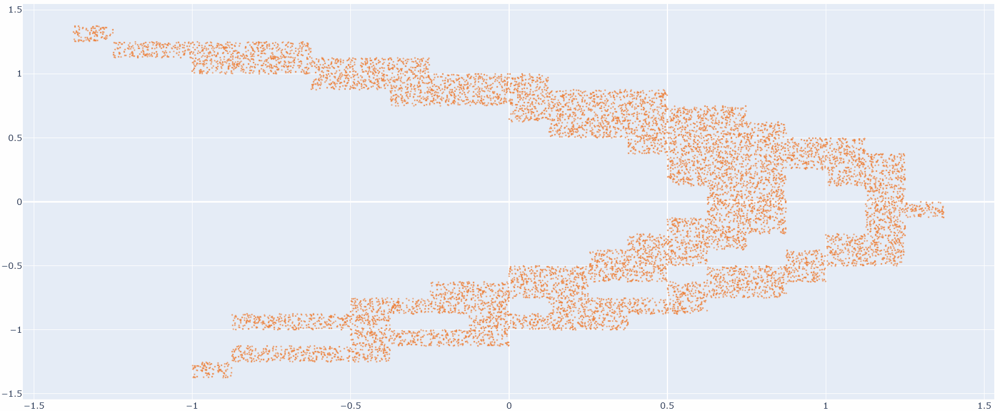
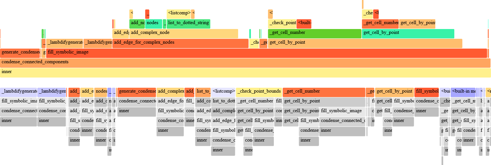

# Chart Builder Application (Python)

Python implementation of
[chart-builder](https://github.com/kostmetallist/chart-builder) project.

<p align="center">
  
</p>

Original application was written on Java 10, while this one targets at
imitating the same functionality using Python infrastructure.

## Technologies used

- [NumPy](https://numpy.org)
- [Sympy](https://www.sympy.org/en/index.html)
- [Plotly](https://plotly.com/python)
- [NetworkX graph library](https://networkx.org)
- [Numba](https://numba.readthedocs.io)
- PyParallel (`TBD`)

## How to run

1. enter the virtual environment with `pipenv shell`
2. install required dependencies with `pipenv install`
3. run `start.py`

## A note on settings

The program runs as a CLI application and supports settings file dump on
each user session. That is, whenever you enter custom values for certain
mode parameters, they are backed up (to `settings/.recent_session`) and then
shown during the following runs, which brings a pinch of ergonomics.

## Profiling

To detect bottlenecks, there is a `flameprof` dependency in the `Pipfile`.
Custom `dump_profile` decorator is used to denote functions of interest and
to dump the profile. For visualizing performance statistics, run the following:

```
python -m flameprof ./monitoring/<timestamp>.dmp > output.svg
```

An output SVG will contain a flame graph of executed program.

<p align="center">
  
</p>

## Troubleshooting

Please leave your suggestions and bug reports at
[issues page](https://github.com/kostmetallist/chart-builder-py/issues)
